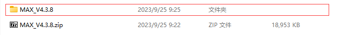
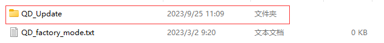
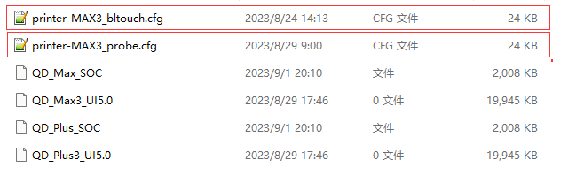
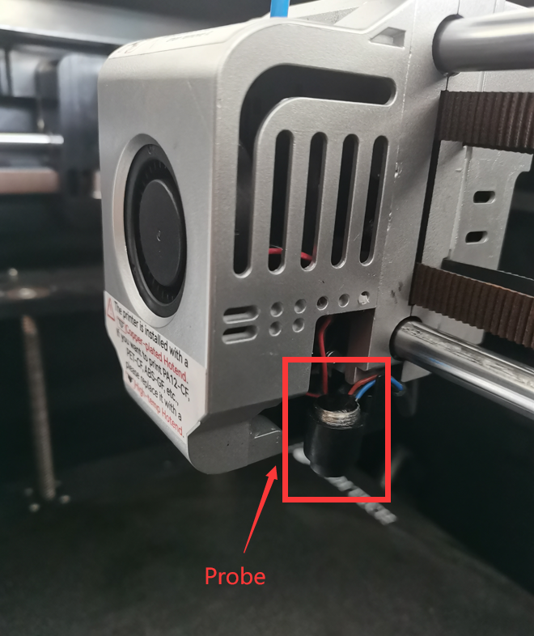
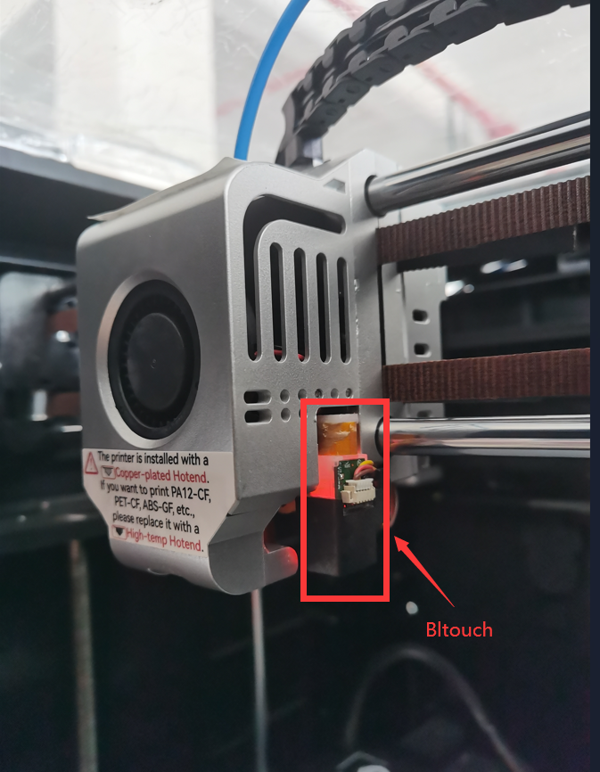
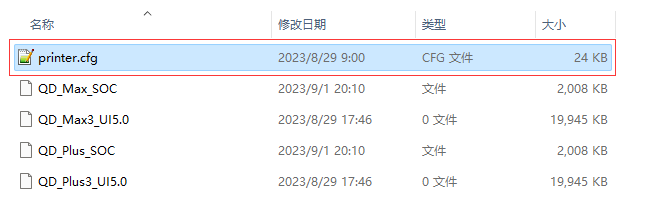

# Document Instructions
QIDI_Max3 is a server-side software that interacts with the screen in the Maxx3 model system. This document contains our source code, and we provide the safer solution to update it:Download the packaged file to a USB drive and insert it into the machine for updating.  
QIDI provides a packaged version file in the version bar next to it. Please download the compressed package file starting with MAX.  
We have provided multiple different versions of source code. Please select the branch you want to download, and the name of the branch is the corresponding version name.
## 4.3.12 Update content

### **FUNCTIONALITY UPDATE**
<strong><ol>
<li>Enhanced Filament Loading/Unloading During Printing: Modified the logic for filament loading and unloading. For unloading, a prompt to cut the filament is displayed. </li>
<li>Modified Filament Loading Sizes: Options for filament loading sizes are now 20mm, 50mm, and 100mm.</li>
<li>Deletion of Previous Print Cache Files Upon Update: The update will now automatically delete previously stored print cache files.</li>
<li>
Updated Default Save Parameters: By default, the filament runout detection will be enabled after the update.
</li>
<li>Preservation of Original Offset Values: The compensation values in the klipper_config/configuration will be retained post-update.
</li>
<li>Removal of Last Travel Distance in Leveling Record: The leveling process now starts from zero travel distance.</li>
<li>Modifications to Hidden WIFI Functionality: The interface now includes an option to input a hidden WIFI network.</li>
</ol></strong>

### **UI UPDATE**
<strong><ol>
<li> UI Changes for Filament Runout Detection: Modified the interface icons corresponding to the enable/disable state during printing.</li>
<li>Memory Full Pop-Up Notification: Added a notification for when the memory is full.</li>
<li>Addition of an 'Updating' Interface: Introduced an interface screen that displays during updates.</li>
</ol></strong>

### **BUG FIX**
<strong><ol>
<li>Fixed Leveling Completion Screen Freeze: Removed the conditional check after pressing the button, allowing for an unconditional transition to the next screen.</li>
</ol></strong>

## Detailed update process
#### Update Package File Selection
Note that all updates cannot be updated from higher versions  

We are equipped with two different probes for the Max model, one is a regular probe and the other is a Bltouch probe. Different types of probes require different configuration files.
So we have placed configuration files suitable for two different probes in the upgrade package. You can freely choose to adapt to the configuration of the probe you are currently using, but this requires you to perform some operations on this upgrade package file. Don't worry, it is just a simple file operation, and we will provide a complete operation example here.  

1. Download the latest upgrade package file and unzip it in the current folder, open the QD in it_ The Update folder, as shown in the figure below, shows two different configuration files inside, and you only need one of them.

  

2.Identify the type of probe you are using

3.Keep only the configuration file of the corresponding probe, delete the other one, and rename the remaining one to 'printer. cfg'.
As shown in the following figure, you can use this update package to update your machine

You may be worried about why the max model has a plus model in the configuration file. Please don't worry, this is for users who may have just reset the storage in the machine. The reset version will fall back to the ancient version, making it difficult to recognize the firmware with normal names. You don't need to worry about the existence of these files, which will affect your upgrade. The system will find the files it needs to update itself, The extra files will not have any impact on it.  

#### Packaged files

1. Select the latest version in the version release bar next to it, download the compressed file package starting with MAX and extract it locally.  
<a href="https://github.com/QIDITECH/QIDI_MAX3/releases/tag/Max3_V4.3.10/MAX3_V4.3.10.rar">Jump link </a>
2. Place the files in the USB drive, such as

3. Insert the USB drive into the machine's USB interface, and an update prompt will appear on the version information interface. Click the update button to restart according to the prompt.

## Report Issues and Make Suggestions

***You can contact [After-Sales Service](https://qidi3d.com/pages/warranty-policy-after-sales-support) to report issues and make suggestions.***  
***You can directly contact our after-sales team for any issues related to machine mechanics, slicing software, firmware, and various machine issues. They will reply to your questions within twelve hours.***

## Others

Different from the usual method of directly accessing the fluid page through an IP address, the QIDI version sets the default port number to 10088, so you need to add `:10088` after the machine's IP to access the fluid page 
The 3D printers of QIDI are based on Klipper.On the basic of Klipper open source project, we have made some modifications to it's source code to meet some of the user's needs.At the same time, we have also made modifications to Moonraker, so that the screens we set can correspond to the operations on the page.
Thanks to the developers and maintainers of these open source projects.Please consider using or supporting these powerful projects.

 Software |  QIDI edition
 ----|----
**Klipper** | **[https://github.com/QIDITECH/klipper](https://github.com/QIDITECH/klipper)**
**Moonraker** | **[https://github.com/QIDITECH/moonrake](https://github.com/QIDITECH/moonrake)**

  
