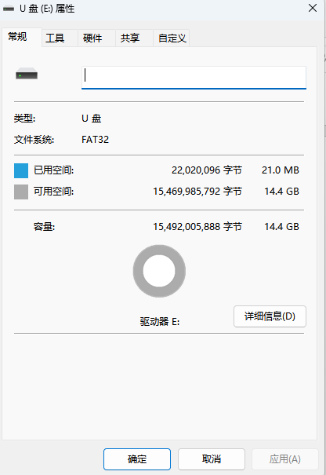
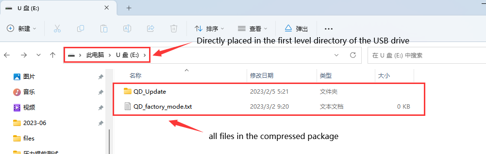

<p align="center"></p>
<p align="center"><a href="/LICENSE"></a></p>

# Document Instructions
QIDI_Max3 is a server-side software that interacts with the screen in the Maxx3 model system. This document contains our source code, and we provide two ways to update it: one is to download the packaged file to a USB drive and insert it into the machine for updating, and the other is to compile and update it through source code.  
***Please note that manual updates may affect normal after-sales service, so it is best to automatically update through the machine with packaged files.***  
QIDI provides a packaged version file in the version bar next to it. Please download the compressed package file starting with MAX.

## Detailed update process
#### Packaged files
1. Prepare a blank named USB drive.Please ensure that the device name of the USB drive is empty

<p align="left"></p>

2. Select the latest version in the version release bar next to it, download the compressed file package starting with MAX and extract it locally.  
<a href="https://github.com/QIDITECH/QIDI_MAX3/releases/tag/Max3_V4.3.1/MAX3_V4.3.0.rar">Jump link </a>
3. Place the files in the USB drive, such as

<p align="left"></p>

4. Insert the USB drive into the machine's USB interface, and an update prompt will appear on the version information interface. Click the update button to restart according to the prompt.


#### Compile
1. Connect machines to the network and connect through SSH
2. Log in as root.The password is `makerbase`
3. After logging in, enter the following code block
```shell
cd /root
rm -rf xindi
git clone https://github.com/QIDITECH/QIDI_MAX3.git
```
4. Code cloning may take some time, please be patient. If there are certificate issues, please confirm if the system time is correct. After the code cloning is completed, enter the following code block
```shell
mv QIDI_MAX3 xindi
cd /root/xindi/build
cmake ..
make
```
5. The complete code compilation also takes some time, patiently wait for the compilation to complete, shut down and wait for 20 seconds before starting.

## Report Issues and Make Suggestions

***You can contact [After-Sales Service](https://qidi3d.com/pages/warranty-policy-after-sales-support) to report issues and make suggestions.***  
***You can directly contact our after-sales team for any issues related to machine mechanics, slicing software, firmware, and various machine issues. They will reply to your questions within twelve hours.***

## Others

Different from the usual method of directly accessing the fluid page through an IP address, the QIDI version sets the default port number to 10088, so you need to add `:10088` after the machine's IP to access the fluid page</br>
The 3D printers of QIDI are based on Klipper.On the basic of Klipper open source project, we have made some modifications to it's source code to meet some of the user's needs.At the same time, we have also made modifications to Moonraker, so that the screens we set can correspond to the operations on the page.
Thanks to the developers and maintainers of these open source projects.Please consider using or supporting these powerful projects.

 Software |  QIDI edition
 ----|----
**Klipper** | **[https://github.com/QIDITECH/klipper](https://github.com/QIDITECH/klipper)**
**Moonraker** | **[https://github.com/QIDITECH/moonrake](https://github.com/QIDITECH/moonrake)**


  
